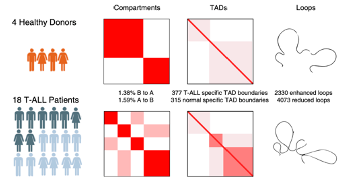

Welcome to Chen Lab at China Agricultural University.

We are interested in applying statistical or machine-learning methods in genetic and epigenetic studies. Currently, We mainly focus on    
1) developing novel statistical methods to analyze and explore multi-omic data including single-cell omics data, as well as   
2) using molecular biology, genomics, and bioinformatics methods to explore gene regulation networks in early embryo development.

<meta http-equiv="Content-Type" content="text/html;charset=utf-8">

News
------
* 2024.12. Chen lab officially launched.
* 2024.12. Welcome Zijun Cheng to join the lab!
* 2025.09. Welcome Rongkai Lv, Ziyu An, Wenhui Lv to join the lab!

Members
------

    
    

        
Rongkai Lv

        
Ph.D. Student, CAU. (2025.9-)

        
M.Phil., HMU. (2022.9-2025.6)

    

    
    

        
Ziyu An

        
Ph.D. Student, CAU. (2025.9-)

        
B.Sc., CAU. (2021.9-2025.6)

    

    
    

        
Ziyu An

        
Ph.D. Student, CAU. (2025.9-)

        
B.Sc., XYNU. (2021.9-2025.6)

    

    
    

        
Zijun Cheng

        
Research assistant

        
M.Phil. Student, SAU. (2021.9-2024.6)

    

    
    

        
Haochen Zhong

        
Co-mentor students
 
        
B.Sc., Tsinghua U. (2021.9-)

    

Previous Works
------
**Peer-reviewed papers**

 <i><b>- ZGA regulators -</b></i>

<table class="imgtable">

<tr>
<td>&nbsp;</td>
<td>
 OBOX regulates murine zygotic genome activation and early development 

 Ji, S.*,<b> Chen, F.*</b>, Stein, P.*, Wang, J.*, Zhou, Z.*, Wang, L.*, … & Xie, W.#

<b>Nature</b>, 2023 [<a href="https://www.nature.com/articles/s41586-023-06428-3">Paper</a>]

</td>
</tr>

<tr>
<td>&nbsp;</td>
<td>
 Maternal TDP-43 interacts with RNA Pol II and regulates zygotic genome activation 

 Nie, X.*, Xu, Q.*, Xu, C.*, <b>Chen, F.*</b>, Wang, Q., Qin, D., … & Li, L. 

<b>Nature communications</b>, 2023 [<a href="https://www.nature.com/articles/s41467-023-39924-1">Paper</a>]

</td>
</tr>
</table>

 <i><b>- 3D genome methods -</b></i>

<table class="imgtable">

<tr>
<td>&nbsp;</td>
<td>
 HiCDB: a sensitive and robust method for detecting contact domain boundaries 

 <b>Chen, F.*</b>, Li, G.*, Zhang, M. Q., & Chen, Y. 

<b>Nucleic acids research</b>, 2018 [<a href="https://academic.oup.com/nar/article/46/21/11239/5090284">Paper</a>][<a href="https://github.com/ChenFengling/RHiCDB">RCode</a>][<a href="https://github.com/ChenFengling/HiCDB">MatlabCode</a>]

</td>
</tr>
</table>

 <i><b>- 3D genome in differention and disease -</b></i>

<table class="imgtable">

<tr>
<td>&nbsp;</td>
<td>
 MyoD is a 3D genome structure organizer for muscle cell identity 

 Wang, R.*, <b>Chen, F.*</b>, Chen, Q.*, Wan, X.*, … & Zhu, D. 

<b>Nature communications</b>, 2022 [<a href="https://www.nature.com/articles/s41467-021-27865-6">Paper</a>]

</td>
</tr>

<tr>
<td>&nbsp;</td>
<td>
 3D genome alterations associated with dysregulated HOXA13 expression in high-risk T-lineage acute lymphoblastic leukemia. 

 Yang, L.*, <b>Chen, F.*</b>, Zhu, H.*, Chen, Y., … & Wu, H. 

<b>Nature communications</b>, 2021 [<a href="https://www.nature.com/articles/s41467-021-24044-5">Paper</a>]

</td>
</tr>
</table>

