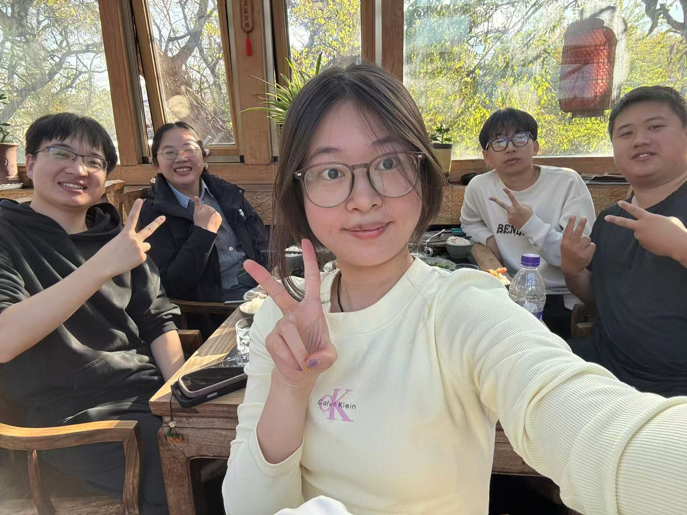

📸 Welcome to our lab activities gallery! Here we capture the joyful moments of our team building activities, including delicious dinners and exciting hiking adventures around Beijing.

*2025.11 Happy Autumn out in Xiang Shan!*
  
  

> "A happy lab is a productive lab. We believe that strong personal connections and shared experiences outside the laboratory enhance our scientific collaboration and creativity inside the lab."

---

*These activities help us build a supportive and collaborative research environment.*  
*Last updated: {{ site.time | date: '%B %d, %Y' }}*

*Have more photos to share? Send them to [cfl24@cau.edu.cn](mailto:cfl24@cau.edu.cn)*
